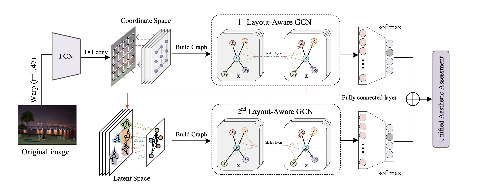

# Hierarchical Layout-Aware Graph Convolutional Network for Unified Aesthetics Assessment

[[Paper](https://openaccess.thecvf.com/content/CVPR2021/papers/She_Hierarchical_Layout-Aware_Graph_Convolutional_Network_for_Unified_Aesthetics_Assessment_CVPR_2021_paper.pdf)]  [[Supplementary Material](https://openaccess.thecvf.com/content/CVPR2021/supplemental/She_Hierarchical_Layout-Aware_Graph_CVPR_2021_supplemental.pdf)]  [[Jittor Code](https://github.com/days1011/hlagcn-jittor)]  [[Pytorch Code]()(coming soon)]

### Abstract

Learning computational models of image aesthetics can have a substantial impact on visual art and graphic design. Although automatic image aesthetics assessment is a challenging topic by its subjective nature, psychological studies have confirmed a strong correlation between image layouts and perceived image quality. While previous state-of-the-art methods attempt to learn holistic information using deep Convolutional Neural Networks (CNNs), our approach is motivated by the fact that Graph Convolutional Network (GCN) architecture is conceivably more suited for modeling complex relations among image regions than vanilla convolutional layers. Specifically, we present a Hierarchical Layout-Aware Graph Convolutional Network (HLA-GCN) to capture layout information. It is a dedicated double-subnet neural network consisting of two LA-GCN modules. The first LA-GCN module constructs an aesthetics-related graph in the coordinate space and performs reasoning over spatial nodes. The second LA-GCN module performs graph reasoning after aggregating significant regions in a latent space. The model output is a hierarchical representation with layout-aware features from both spatial and aggregated nodes for unified aesthetics assessment. Extensive evaluations show that our proposed model outperforms the state-of-the-art on the AVA and AADB datasets across three different tasks.

### Overview


Given the input image, we view the extracted feature maps as representations of nodes throughout all spatial locations. Our HLA-GCN model preserves the image aspect ratio and performs graph reasoning on both coordinate and latent spaces.

### Pipeline



For more details, please refer to our paper.

### Citation

If you found this code useful please cite our work as:

```
@InProceedings{She_2021_CVPR,
    author    = {She, Dongyu and Lai, Yu-Kun and Yi, Gaoxiong and Xu, Kun},
    title     = {Hierarchical Layout-Aware Graph Convolutional Network for Unified Aesthetics Assessment},
    booktitle = {Proceedings of the IEEE/CVF Conference on Computer Vision and Pattern Recognition (CVPR)},
    month     = {June},
    year      = {2021},
    pages     = {8475-8484}
}
```
